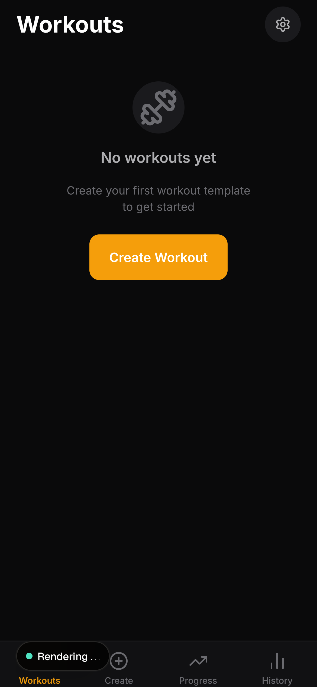
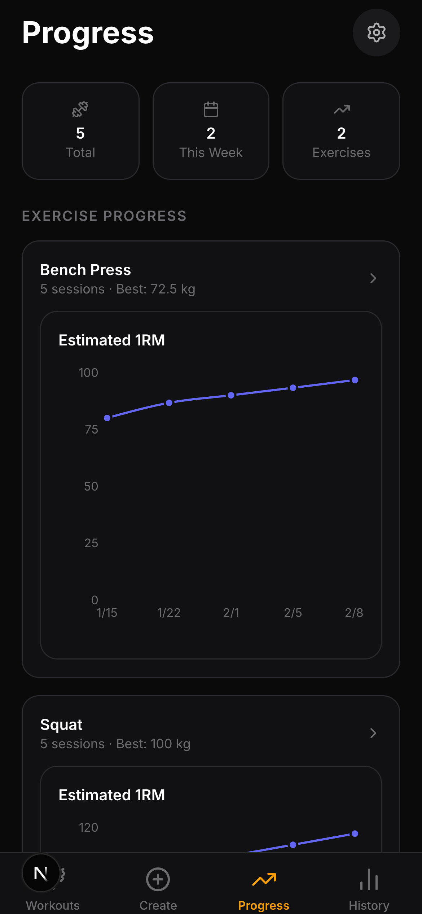
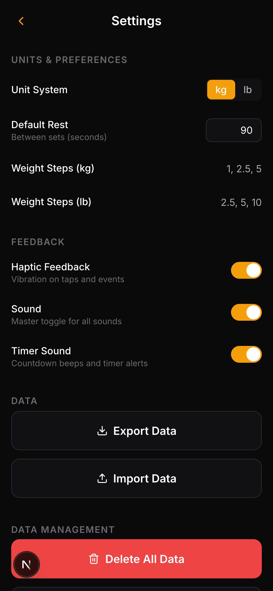
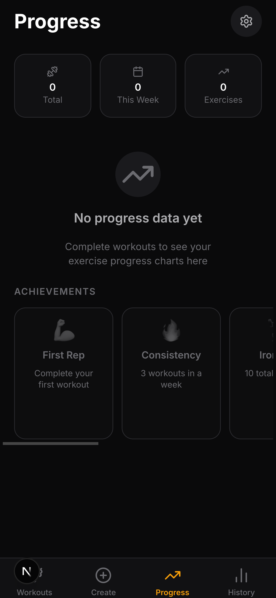
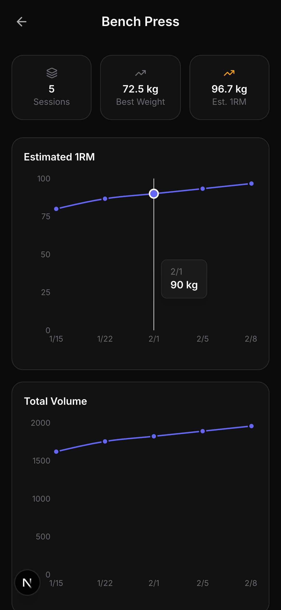
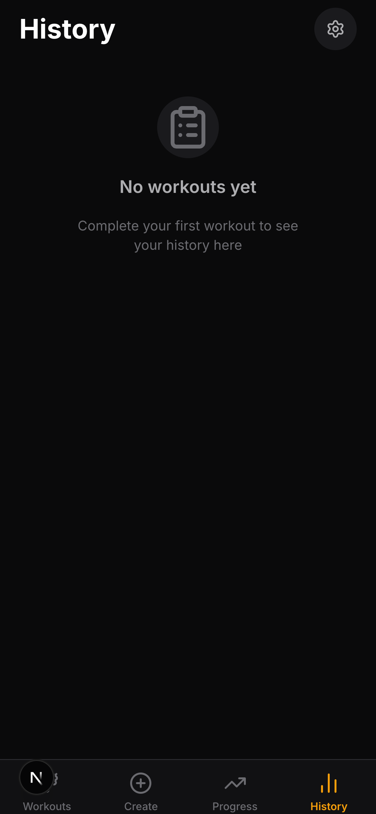
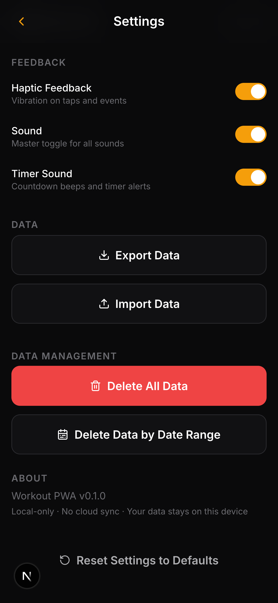
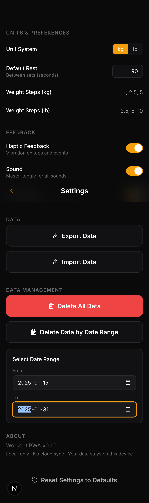
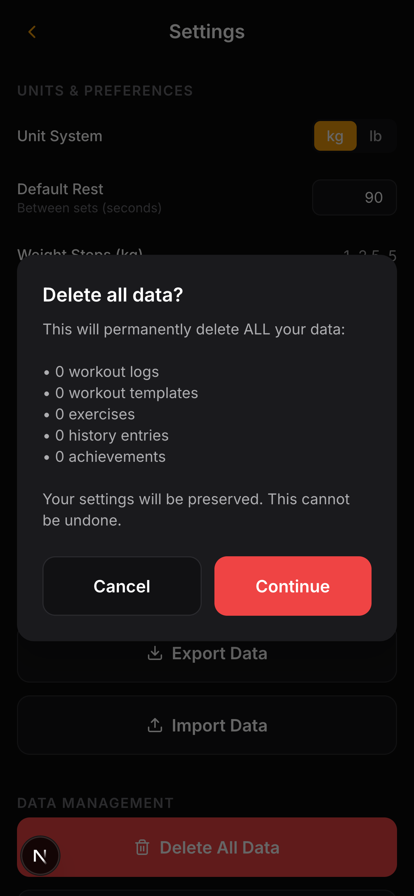
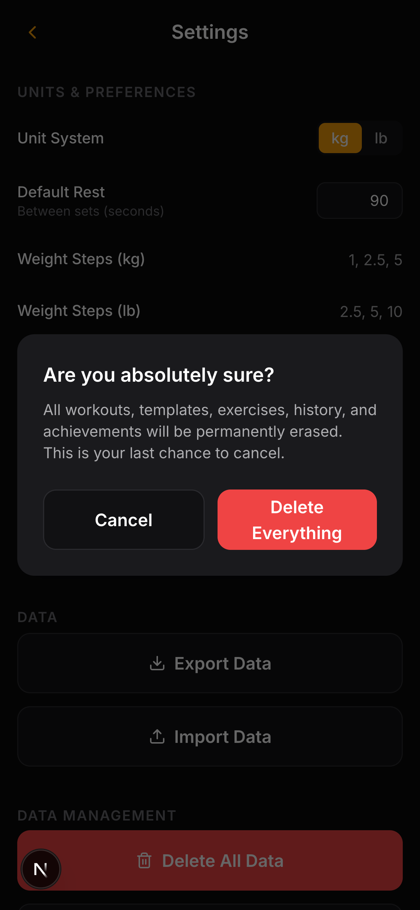

# Workout PWA

A local-first Progressive Web App for tracking weight-training workouts. No accounts. No servers. No cloud. All your data lives in IndexedDB on your device.

Built for intermediate lifters who already know their exercises and programs — designed to be used **at the gym**, between sets, with one thumb and sweaty hands.

<p align="center">
  
  
  
</p>

---

## Features

### Workout Templates
- Create custom workout templates with exercises, sets, reps, and rest timers
- **Superset support** — group multiple exercises into supersets with configurable rest periods
- **AMRAP sets** — mark any set as "As Many Reps As Possible"
- Exercise autocomplete from a built-in library, or create your own
- Duplicate, edit, and archive templates

### Active Workout
- Step-by-step guided workout flow: exercise display, weight logging, rest timer, recap
- **Circular rest timer** with countdown beeps, skip, and +/- time adjustment
- **Wake Lock** keeps your screen on during the workout
- **Haptic feedback** with distinct vibration patterns for taps, success, and timer completion
- **Sound effects** for countdowns, timer completion, and workout celebration
- Auto-start rest timer between sets (configurable)
- End early and save a partial workout at any time

### Weight Logging
- Log weight and reps for each set with stepper controls
- "Same weight" quick-apply from your previous set
- "Apply to remaining" fills all remaining sets of the same exercise
- Smart navigation skips over pre-filled sets
- Weights stored as **integer grams** internally, displayed in your preferred unit (kg or lb)
- Historical weight prefill from your last session

### Progress Tracking
- **Progress dashboard** with summary cards: total workouts, weekly count, unique exercises, average duration, total time invested
- **Personal records** per exercise: best weight, estimated 1RM (Epley formula), best session volume
- **Exercise progress charts** (Recharts) — track estimated 1RM, best weight, or volume over time
- Date-filterable exercise history with drill-down to individual sessions

### Achievements
Unlockable badges that celebrate your milestones:

| Badge | Name | Condition |
|-------|------|-----------|
| :muscle: | First Rep | Complete your first workout |
| :fire: | Consistency | 3 workouts in a week |
| :weight_lifting: | Iron Will | 10 total workouts |
| :trophy: | PR Breaker | New highest estimated 1RM on any exercise |
| :crown: | Volume King | New highest session volume for an exercise |
| :zap: | Superset Master | Complete a workout with supersets |
| :100: | Century | 100 total workouts |

### Data Management
- **Full export/import** — JSON backup with validation and conflict handling
- **Delete by date range** with live preview of affected records
- **Nuclear delete** with two-step confirmation and 3-second countdown safety
- **Crash recovery** — interrupted workouts are auto-saved and can be resumed within 4 hours

### Offline & PWA
- Installable on any device (iOS, Android, desktop)
- **Fully offline-capable** — Serwist service worker precaches all assets
- Standalone display mode with custom theme color
- Portrait orientation optimized

---

## Tech Stack

| Layer | Technology | Why |
|-------|-----------|-----|
| **Framework** | [Next.js 16](https://nextjs.org) + React 19 | App Router, static export, file-based routing |
| **Language** | TypeScript 5.9 (strict) | Type safety across the entire codebase |
| **State** | [Zustand v5](https://zustand.docs.pmnd.rs/) | Lightweight, selector-based reactivity |
| **Storage** | [Dexie v4](https://dexie.org) (IndexedDB) | Structured client-side persistence with compound indexes |
| **Styling** | [Tailwind CSS v4](https://tailwindcss.com) | Utility-first, dark-first design tokens |
| **Charts** | [Recharts 3](https://recharts.org) | Lazy-loaded SVG charts for progress visualization |
| **Icons** | [Lucide React](https://lucide.dev) | Consistent, tree-shakeable icon set |
| **PWA** | [Serwist v9](https://serwist.pages.dev) | Service worker generation, offline caching |
| **Testing** | [Vitest 4](https://vitest.dev) + [Playwright](https://playwright.dev) | Unit tests + end-to-end browser tests |

---

## Getting Started

### Prerequisites

- **Node.js** 18+ and **npm**

### Install & Run

```bash
# Clone the repository
git clone https://github.com/tanglefast23/gym_app.git
cd gym_app

# Install dependencies
npm install

# Start development server
npm run dev
```

Open [http://localhost:3000](http://localhost:3000) in your browser.

### Scripts

| Command | Description |
|---------|-------------|
| `npm run dev` | Start development server |
| `npm run build` | Production build (static export) |
| `npm run start` | Serve production build |
| `npm run lint` | Lint with ESLint (zero warnings) |
| `npm run lint:fix` | Lint and auto-fix |
| `npm run typecheck` | TypeScript type checking |
| `npm run test` | Run unit tests (Vitest) |
| `npm run test:watch` | Run tests in watch mode |
| `npm run e2e` | Run end-to-end tests (Playwright) |

---

## Architecture

### Principles

1. **Local-first** — Zero network dependencies. All data lives in IndexedDB on the user's device.
2. **Types first** — `src/types/workout.ts` is the single source of truth for all data shapes.
3. **One-way dependencies** — `types` -> `lib` -> `stores` -> `hooks` -> `components` -> `app`
4. **Integer grams** — All weights stored as integer grams internally. Unit conversion happens only at the display boundary.
5. **Snapshot pattern** — Templates are deep-copied when a workout starts. History is immutable.

### Project Structure

```
src/
├── app/                    # Next.js App Router pages
│   ├── page.tsx            # Home — workout template list
│   ├── create/             # Create new template
│   ├── edit/[id]/          # Edit existing template
│   ├── workout/[id]/       # Active workout session
│   ├── history/            # Workout history + exercise detail
│   ├── progress/           # Progress dashboard + achievements
│   ├── settings/           # Settings & data management
│   └── ~offline/           # Offline fallback
│
├── components/
│   ├── ui/                 # Reusable primitives (Button, Card, BottomSheet, Toast, etc.)
│   ├── layout/             # AppShell, Header, BottomTabBar
│   ├── active/             # Active workout (ExerciseDisplay, RestTimer, WeightRecap)
│   ├── history/            # LogCard, ProgressChart, AchievementCard
│   └── workout/            # Template editor (WorkoutCard, BlockEditors)
│
├── stores/                 # Zustand stores
│   ├── activeWorkoutStore  # Session state, step engine, crash recovery
│   └── settingsStore       # User preferences (persisted to localStorage)
│
├── hooks/                  # Custom hooks
│   ├── useTimer             # Rest timer (Web Worker)
│   ├── useWakeLock          # Screen Wake Lock API
│   ├── useHaptics           # Vibration patterns
│   ├── useSwipeNavigation   # Gesture nav
│   └── useInstallPrompt     # PWA install prompt
│
├── lib/                    # Pure logic (no React imports)
│   ├── db                   # Dexie database + schema
│   ├── stepEngine           # Generate workout steps from template blocks
│   ├── calculations         # 1RM (Epley), volume, weight formatting
│   ├── achievements         # Badge definitions + unlock checks
│   ├── queries              # Database query helpers
│   ├── exportImport         # Backup/restore with validation
│   ├── validation           # Input constraints
│   └── sfx                  # Sound effect player
│
├── workers/
│   └── timer.worker         # Web Worker for background timer ticks
│
└── types/
    └── workout.ts           # All TypeScript interfaces & constants
```

### Database Schema (Dexie / IndexedDB)

| Table | Purpose | Key Indexes |
|-------|---------|-------------|
| `exercises` | Exercise library | `id` |
| `templates` | Workout blueprints | `id`, `isArchived` |
| `logs` | Completed workout sessions (immutable) | `id`, `startedAt` |
| `exerciseHistory` | Denormalized per-exercise stats for charts | `exerciseId`, `performedAt` |
| `achievements` | Unlocked badges | `achievementId`, `unlockedAt` |
| `crashRecovery` | Last active session snapshot (4-hour TTL) | `id` |

---

## Design

### Visual Identity

Dark-first, high-contrast, amber-accented. Think Apple Fitness+ energy — premium feel, polished animations, meaningful celebration moments.

| Token | Value | Usage |
|-------|-------|-------|
| Background | `#0A0A0B` | Page canvas |
| Surface | `#111113` | Cards, inputs |
| Elevated | `#1A1A1D` | Sheets, dialogs |
| Accent | `#F59E0B` | Primary CTAs (amber) |
| Success | `#22C55E` | Completions |
| Danger | `#EF4444` | Destructive actions |

### Typography

- **Inter** for all UI text
- **DM Mono** for numbers (tabular-nums for aligned digits)

### Feedback Layers

Important actions use multi-sensory feedback:
- **Visual** — Color changes, animations, icon swaps
- **Haptic** — Distinct vibration patterns (tap: 50ms, success: [100,50,100,50,200], timer: [200,100,200])
- **Audio** — Sound effects (countdown beeps, completion celebration)

All feedback respects user preferences and degrades gracefully.

### Animations

Custom easing curves (expo-out, quart-out, back-out) with physical feel:
- Exercises slide in from the right (forward progress)
- Rest timer pulses (urgency)
- Bottom sheets spring up (physicality)
- Achievement badges shimmer on unlock
- All animations disabled when `prefers-reduced-motion: reduce` is set

---

## Screenshots

<p align="center">
  
  
  
</p>

<p align="center">
  
  
  
</p>

<p align="center">
  
  
  
</p>

---

## Deployment

This app exports as a **static site** — no server required.

```bash
npm run build
```

The output in `.next/` can be deployed to any static hosting provider:
- **Vercel** (recommended) — auto-detects Next.js
- **Netlify** — set build command to `npm run build`
- **GitHub Pages** — deploy the `out/` directory
- **Cloudflare Pages** — framework preset: Next.js (Static)

The service worker enables full offline functionality after the first visit.

---

## Contributing

1. Fork the repository
2. Create a feature branch (`git checkout -b feature/your-feature`)
3. Make your changes
4. Run linting and tests:
   ```bash
   npm run lint
   npm run typecheck
   npm run test
   ```
5. Commit with a descriptive message
6. Push and open a pull request

### Code Standards

- TypeScript **strict mode** — no `any` types
- Named exports only (no default exports)
- Functions under 50 lines
- Tailwind classes only (no inline styles)
- Zustand selectors required: `useStore((s) => s.field)`, never `useStore()`
- All weights in **integer grams** internally

---

## License

This project is private. All rights reserved.
